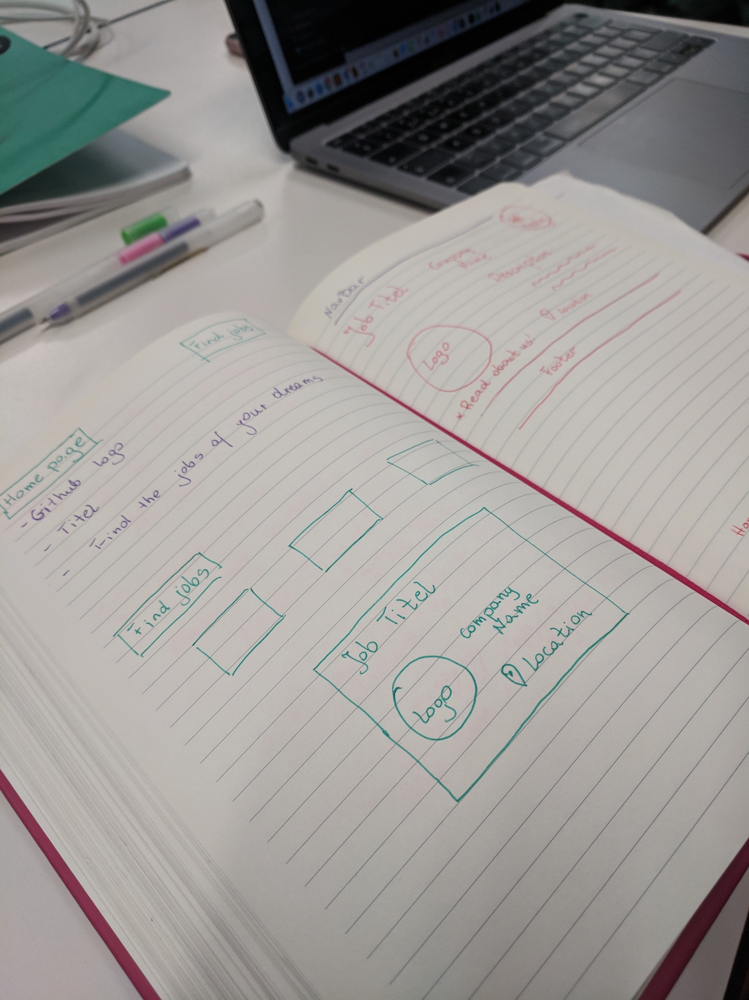
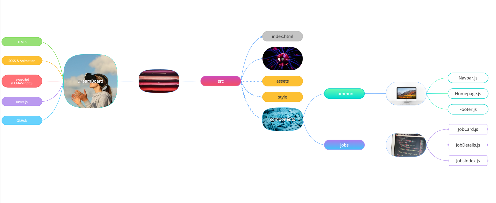
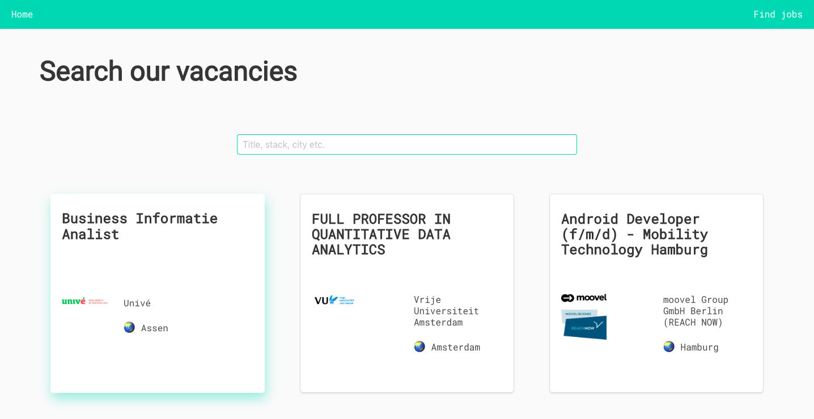
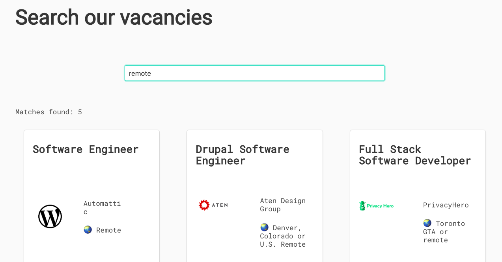
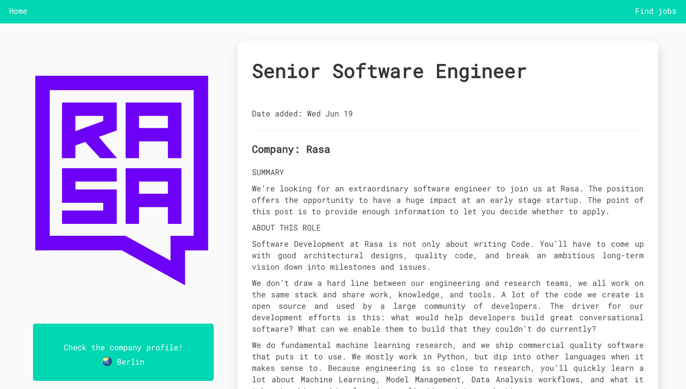
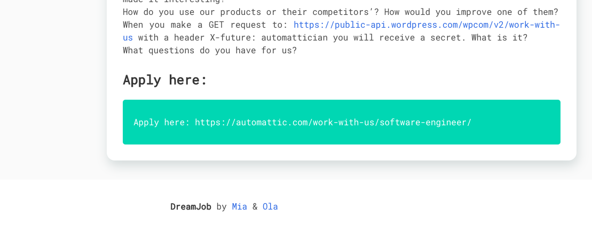

# Software Engineneering Immersive: Project 2
This is my second project during the General Assembly Software Engineering Immersive course (Week 6). It was part of a two-day long "Reactathon" and it was made in collaboration with Aleksandra Skoczylas (https://github.com/leealex88).

---

# DreamBoard

This project is a job board, built using Github Jobs API (https://jobs.github.com/api).

## Built With


| HTML5 | SCSS  | Javascript  | GitHub  |
|   | Animation  | ECMAScript6  | Git versions control  |
|   | | React.js  | |

## Deployment

The job board is deployed on Heroku and it can be found here:

## Getting Started

Use the clone button to download the game source code. In the terminal enter the following commands:

```
<!-- To install all the packages listed in the package.json: -->
$ npm i
<!-- Run the app in your localhost: -->
$ npm run serve
<!-- Check the console for any issues and if there are check the package.json for any dependancies missing  -->
```

## Website Architecture

### The GitHub Jobs API
Because we only had two days to complete the project we wanted to find an API that didn't need authentication. The GitHub Jobs API allows you to search, and view jobs with JSON without an authentication key. If you want more information on the API the documentation can be found here: https://jobs.github.com/api

### Designing the wireframes and the user experience
Once we chose which API to use we began to design the wireframes and the UX. Here are some notes we took at the beginning of the process:



and here is a mind-map we used to plan and structure the project:



---
### Homepage


We decided on having a simple Home page (Homepage.js) the user lands on when visiting the site, then they can use the link in the navigation bar or the button below the title to move on to the page that contains all the job listings.


---
### Job listings page


Once you land on the jobs listing page (JobsIndex.js), a function runs to get the data from the GitHub API and it populates the page with as many cards as the number of openings. The template of each card is stored in the JobCard.js component and it uses the data passed down by the parent component (JobsIndex.js).



---

In this page there is a search box which allows the user to filter through the array of cards and find the jobs that match their search. This is done using the filterJob function which returns a filtered array of jobs:

```js
filterJobs() {
  const regexp = new RegExp(this.state.searchTerm, 'i')
  return this.state.data.filter(item => regexp.test(item.title) || regexp.test(item.description) || regexp.test(item.location))
}
```



At the bottom of the page there is also a pagination feature that allows the user to navigate the job listings more easily.

---
### Job details page


If you click on one of the cards in the job listings page you are redirected to a page with more details about the job. In this jobs details page there is a function that loads the API data specifically for the right job using the ID of the chosen card:


```js
componentDidMount () {
  axios.get(`https://cors-anywhere.herokuapp.com/https://jobs.github.com/positions/${this.props.match.params.id}.json`)
    .then(res => this.setState({data: res.data}))
    .catch(err => console.log(err))
}
```


The page includes the job title, location, description (etc.) as well as more details on how to apply.



---



---

## Challenges and future improvements


This was the first time we experienced working as part of a team and collaborating on a project on a very short timescale. In fact, the deadline for the project was only two days.

The first challenge we encountered was with our filterJob function. We were trying to apply the function to  three different search inputs and run the event listeners for all three of them in the same function as well. So we decided to create just one input with three different search conditions (title, description, location). We also refactored the filter function into two different ones to improve readability.


In terms of future improvements, instead of the filter input we would like to add a search form, which is going to allow the user to perform a much more detailed search and display the jobs that meet the criteria of the user. This is a form from Totaljobs we would use as an inspiration:


We would also like to add a "sort by recently added" option to display the most recently published job offers at the top of the page.

## Authors

Mia Meroi - Second Project
Link to portfolio here:

Aleksandra Skoczylas - Second Project
Link to portfolio here:
